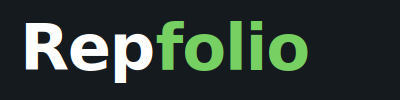

# Repfolio Logo Assets

Complete logo package for the Repfolio sports training SaaS platform.

## Files Included

### Primary Logos (Horizontal Wordmarks)

#### `repfolio-logo-primary.svg` ⭐ PRIMARY LOGO
- **Use for:** Main website header, marketing materials, light backgrounds
- **Colors:** Rep (Charcoal Blue 900 #151A1E) + folio (Fern 600 #468657)
- **Size:** 400×100px viewBox
- **Background:** Transparent
- **When to use:** This is your default logo for 90% of use cases

#### `repfolio-logo-dark.svg`
- **Use for:** Dark backgrounds, dark mode UI, footer
- **Colors:** Rep (White #FFFFFF) + folio (Bright Fern 400 #76D062)
- **Size:** 400×100px viewBox
- **Background:** Dark (Charcoal Blue 900 #151A1E)
- **When to use:** Any dark background where primary logo won't have enough contrast

#### `repfolio-logo-compact.svg`
- **Use for:** Mobile headers, navigation bars, tight spaces
- **Colors:** Rep (Charcoal Blue 900) + folio (Fern 600)
- **Size:** 300×60px viewBox (smaller, more horizontal)
- **Background:** Transparent
- **When to use:** Mobile viewports, constrained horizontal space

### Single Color Versions

#### `repfolio-logo-charcoal.svg`
- **Use for:** Print materials (single color), minimal contexts
- **Color:** Charcoal Blue 900 (#151A1E)
- **When to use:** Business cards, letterhead, fax, low-color printing

#### `repfolio-logo-fern.svg`
- **Use for:** Brand-forward marketing, promotional materials
- **Color:** Fern 600 (#468657)
- **When to use:** When you want strong brand color presence

#### `repfolio-logo-white.svg`
- **Use for:** Very dark backgrounds, photos with dark overlays
- **Color:** White (#FFFFFF)
- **Background:** Dark (for preview)
- **When to use:** Dark hero images, video overlays

### Alternative Style

#### `repfolio-logo-lowercase.svg`
- **Use for:** More casual/friendly contexts, startup vibe
- **Colors:** rep (Fern 700 #356541) + folio (Bright Fern 500 #54C43B)
- **Size:** 400×100px viewBox
- **When to use:** Internal tools, community features, casual marketing

### Icons & App Marks

#### `repfolio-icon.svg` ⭐ PRIMARY ICON
- **Use for:** Favicon, app icon, profile pictures
- **Design:** White "R" on Fern 600 background
- **Size:** 512×512px (square)
- **Format:** 64px rounded corners (12.5% radius)
- **When to use:** iOS/Android app icon, browser favicon, social media profiles

#### `repfolio-icon-gradient.svg`
- **Use for:** Premium app icon variant, special promotional materials
- **Design:** White "R" on Fern-to-Bright-Fern gradient
- **Size:** 512×512px (square)
- **Format:** 64px rounded corners
- **When to use:** App Store screenshots, premium marketing collateral

---

## Usage Guidelines

### Minimum Sizes
- **Wordmark logos:** 24px height on mobile, 32px on desktop
- **Icon:** 16px for favicon, 180px for iOS icon, 512px for Android

### Clear Space
Maintain minimum clear space around logos equal to 25% of the logo height.

```
┌────────────────────────────────┐
│        (clear space)           │
│   ┌──────────────────┐         │
│   │    Repfolio      │         │
│   └──────────────────┘         │
│        (clear space)           │
└────────────────────────────────┘
```

### Color Combinations

**✅ APPROVED COMBINATIONS:**
- Primary logo on white/light backgrounds
- Primary logo on Mocha 50 (#F4F1F1)
- Dark logo on Charcoal 900 backgrounds
- White single-color on photos with dark overlay
- Fern single-color on white backgrounds

**❌ DO NOT USE:**
- Primary logo on Fern backgrounds (insufficient contrast)
- Dark logo on light backgrounds (poor legibility)
- Any logo on busy patterns or low-contrast photos
- Logos on gradients that cross both light and dark

### File Format Conversions

These SVG files can be converted to other formats as needed:

**For Web:**
- SVG → Use as-is (infinite scaling, smallest file size)
- SVG → PNG @1x, @2x, @3x (for email clients that don't support SVG)

**For Print:**
- SVG → PDF (vector for high-quality printing)
- SVG → EPS (for older design software)

**For Social Media:**
- Icon SVG → PNG 512×512 (Twitter, Facebook profile)
- Icon SVG → PNG 180×180 (iOS app icon)
- Wordmark → PNG 1500×500 (Facebook cover, YouTube banner)

### Exporting to PNG

To export these SVGs to PNG at different sizes:

**Using Figma/Sketch/Adobe Illustrator:**
1. Import the SVG
2. Export at 1x (base size), 2x (Retina), 3x (mobile high-DPI)

**Using command line (ImageMagick):**
```bash
# Install ImageMagick first
brew install imagemagick

# Export wordmark at different sizes
convert -density 300 -background none repfolio-logo-primary.svg -resize 400x100 repfolio-logo-primary-1x.png
convert -density 300 -background none repfolio-logo-primary.svg -resize 800x200 repfolio-logo-primary-2x.png
convert -density 300 -background none repfolio-logo-primary.svg -resize 1200x300 repfolio-logo-primary-3x.png

# Export icon at standard sizes
convert -density 300 -background none repfolio-icon.svg -resize 512x512 repfolio-icon-512.png
convert -density 300 -background none repfolio-icon.svg -resize 180x180 repfolio-icon-180.png
convert -density 300 -background none repfolio-icon.svg -resize 32x32 repfolio-favicon-32.png
convert -density 300 -background none repfolio-icon.svg -resize 16x16 repfolio-favicon-16.png
```

**Using online converters:**
- CloudConvert (cloudconvert.com/svg-to-png)
- Convertio (convertio.co/svg-png)

---

## Quick Reference

| File | Primary Use | Background | Size |
|------|-------------|------------|------|
| `repfolio-logo-primary.svg` | Default logo | Light | 400×100 |
| `repfolio-logo-dark.svg` | Dark mode | Dark | 400×100 |
| `repfolio-logo-compact.svg` | Mobile header | Light | 300×60 |
| `repfolio-logo-charcoal.svg` | Print/minimal | Light | 400×100 |
| `repfolio-logo-fern.svg` | Brand emphasis | Light | 400×100 |
| `repfolio-logo-white.svg` | Very dark bg | Dark | 400×100 |
| `repfolio-logo-lowercase.svg` | Casual/friendly | Light | 400×100 |
| `repfolio-icon.svg` | App icon/favicon | N/A | 512×512 |
| `repfolio-icon-gradient.svg` | Premium icon | N/A | 512×512 |

---

## Implementation Examples

### HTML (Inline SVG)
```html
<!-- Primary logo -->


<!-- Responsive logo (switches on dark mode) -->



<style>
  .logo-dark { display: none; }
  @media (prefers-color-scheme: dark) {
    .logo-light { display: none; }
    .logo-dark { display: block; }
  }
</style>
```

### React/Next.js
```jsx
import Image from 'next/image'
import LogoPrimary from './repfolio-logo-primary.svg'

export default function Logo() {
  return (
    <Image 
      src={LogoPrimary}
      alt="Repfolio"
      height={32}
      priority
    />
  )
}
```

### Favicon (HTML head)
```html
<link rel="icon" type="image/svg+xml" href="/repfolio-icon.svg">
<link rel="icon" type="image/png" sizes="32x32" href="/repfolio-favicon-32.png">
<link rel="icon" type="image/png" sizes="16x16" href="/repfolio-favicon-16.png">
<link rel="apple-touch-icon" sizes="180x180" href="/repfolio-icon-180.png">
```

---

## Next Steps

1. **Test logos** across different backgrounds and screen sizes
2. **Export PNGs** at 1x, 2x, 3x for web use
3. **Generate favicons** using favicon.io or realfavicongenerator.net
4. **Create app icons** for iOS (180×180, 120×120, 76×76) and Android (512×512, 192×192)
5. **Prepare print materials** by exporting to PDF or EPS
6. **Update brand style guide** with final logo files

## Questions?

Refer to the Repfolio Brand Style Guide (repfolio-brand-guide.html) for complete brand guidelines, color specifications, and usage rules.

---

**Repfolio** • Sports Training SaaS Platform  
Version 1.0 • February 2026
